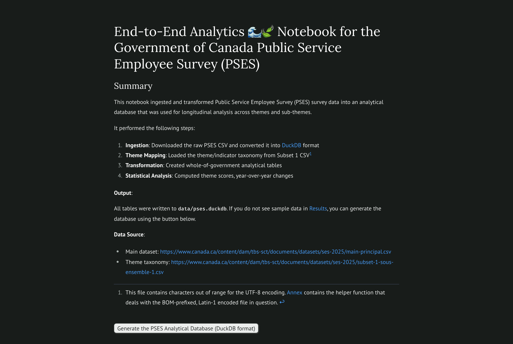

# PSES Analytics

A reproducible data-engineering and analysis workbench for the **Public Service Employee Survey (PSES)** — the Government of Canada's federal public-service employee survey. The pipeline ingests the published PSES results, maps every question onto a theme/sub-theme taxonomy, and builds a set of analytical tables in DuckDB for longitudinal analysis.

> **Status:** work in progress. The notebooks are the starting point for ongoing feature work; the table-building pipeline is functional and reproducible, but the exploration notebook is still under active development.



## What this 12-million-response dataset can answer

The raw PSES release contains **12.2 million response records** — one row per survey question per demographic or organizational slice — covering roughly **287,000 federal public-service respondents** across the **2019, 2020, 2022, and 2024** survey years, organized into **6 themes** and **23 sub-themes**. From this, the pipeline lets you answer questions such as: how positive-response scores on any theme or sub-theme have moved year over year for the whole of government; which of the 59 longitudinal questions show statistically significant change between 2019 and 2024 (chi-square); how strongly any two questions move together (Pearson correlation); and how scores break down by demographic and organizational slice. In short, it turns the published cross-tabulated CSV into a queryable longitudinal database for tracking the health of the federal workforce over time.

## Tech stack

- **DuckDB** — analytical query engine; all tables live in a single `data/pses.duckdb` file
- **Polars** — DataFrame operations
- **marimo** — interactive notebooks (the pipeline and exploration UIs are marimo apps)
- **Altair** — visualization

## Project structure

```
pses-analytics/
├── notebooks/
│   ├── 01_data_engineering_simple.py   # Canonical pipeline: ingestion → analytical tables
│   └── 02_exploration.py                # Interactive analysis & visualization (in progress)
├── assets/
│   └── pses-overview.png                # README hero screenshot (rendered from the notebook)
├── data/                                # Generated DuckDB database (gitignored)
│   └── pses.duckdb
├── sql/                                # SQL templates (single source of truth for exec + display)
│   ├── 01_raw_pses.sql … 10_chi_fetch.sql
│   └── sample_pses_wog.sql
├── pyproject.toml                       # Dependencies (uv-managed)
├── uv.lock
└── README.md
```

> Older/duplicate notebooks and backups are kept locally under `archive/` (gitignored) and can be deleted once no longer needed.

## Quick start

Prerequisites: Python 3.13+ and [uv](https://docs.astral.sh/uv/).

### 1. Install dependencies

```bash
cd pses-analytics
uv sync
```

### 2. Build the analytical database

```bash
uv run marimo edit notebooks/01_data_engineering_simple.py
```

Run this command **from the repository root** so the notebook resolves `data/pses.duckdb` correctly. In the notebook, click the **"Generate the PSES Analytical Database"** button to:

- download the raw PSES CSV from Canada.ca,
- load the theme/indicator taxonomy from the Subset 1 CSV,
- create all analytical tables in `data/pses.duckdb`.

The first run downloads a ~12M-row CSV and builds the database from scratch (a few minutes). If `data/pses.duckdb` already exists, the button rebuilds it for full reproducibility; if you do not click it, the notebook opens the existing database to display samples and statistics.

### 3. Explore the data

```bash
uv run marimo edit notebooks/02_exploration.py
```

This notebook opens `data/pses.duckdb` in **read-only** mode and provides theme/year selectors, trend charts, a year-over-year change heatmap, a chi-square significance table, question-level drill-down, and auto-generated narrative summaries. (This notebook is under active development and references the canonical pipeline notebook.)

## Notebook architecture

### `01_data_engineering_simple.py` — data pipeline

Builds all analytical tables from the source CSVs:

1. **Ingestion** — streams the main PSES CSV into the `raw_pses` table
2. **Theme mapping** — loads the Subset 1 CSV into `theme_map` and `indicator_map`
3. **Transformation** — creates `pses_wog` (whole-of-government spine, typed, `9999 → NULL`), `pses_sliced` (demographic/org slices), and `pses_analysis` (wog + themes)
4. **Statistical analysis** — computes `theme_scores`, `yoy_changes`, `question_correlations`, `chi_square_results`
5. **Validation** — summarizes all tables created

**Output:** `data/pses.duckdb` with 10 tables.

Each transformation step reads its SQL from a `.sql` template in `sql/` and resolves `{token}` placeholders with `str.format()`, so the SQL shown in the notebook's display cells is exactly the SQL that executes — one source of truth per query.

### `02_exploration.py` — interactive analysis

Read-only exploration of the analytical tables: theme selector (6 themes), year filter (2019/2020/2022/2024), trend line charts, year-over-year heatmap, chi-square 2019-vs-2024 table, question drill-down, and leadership narrative summary.

## DuckDB tables

| Table | Rows | Description |
|-------|------|-------------|
| `raw_pses` | 12,179,345 | Full ingested dataset, untouched |
| `theme_map` | 207 | Question → theme/sub-theme lookup |
| `indicator_map` | 23 | Theme/sub-theme reference table |
| `pses_wog` | 772 | Whole-of-government spine, typed, `9999 → NULL` |
| `pses_sliced` | 651,295 | Demographic/org slices |
| `pses_analysis` | 772 | Primary analytical table (wog + themes) |
| `theme_scores` | 72 | Mean SCORE100 per sub-theme per year |
| `yoy_changes` | 54 | Year-over-year deltas |
| `question_correlations` | 1,711 | Pearson r between question pairs |
| `chi_square_results` | 59 | Chi-square 2019 vs 2024 per question |

## Data sources

- **Main dataset:** <https://www.canada.ca/content/dam/tbs-sct/documents/datasets/ses-2025/main-principal.csv>
- **Theme taxonomy:** <https://www.canada.ca/content/dam/tbs-sct/documents/datasets/ses-2025/subset-1-sous-ensemble-1.csv>

The theme taxonomy file is BOM-prefixed and Latin-1 encoded; the pipeline's `fetch_with_bom_strip()` helper normalizes it before loading.

## Theme taxonomy

| ID | Theme | Sub-themes |
|----|-------|-----------|
| 1 | Employee engagement | Employee engagement |
| 2 | Leadership | Immediate supervisor, Senior management |
| 3 | Workforce | Performance management, Job fit & development, Empowerment, Work-life balance, Mobility & retention |
| 4 | Workplace | Organizational goals, Organizational performance, Diversity & inclusion, Anti-racism, Ethical workplace, Physical environment, Official languages, Harassment, Discrimination, Duty to accommodate |
| 5 | Workplace well-being | Safe & healthy workplace, Psychologically healthy workplace, Work-related stress |
| 6 | Compensation | Pay issues, Support to resolve pay issues |

## Analytical notes

- **Longitudinal scope:** only questions appearing in all four survey years (2019, 2020, 2022, 2024) are included in longitudinal analysis.
- **Q73 exclusion:** Q73a–Q73w are 2024-only stress sub-questions and are excluded; Q74 and Q75 are valid stress trend questions.
- **Scoring:** `SCORE100` is the percentage of positive/neutral responses on a 0–100 scale.
- **Chi-square:** all 59 longitudinal questions show statistically significant change (p < 0.05) between 2019 and 2024. With ~186,000 respondents, even a 1% shift is detectable; treat chi-square magnitude as an effect-size proxy.
- **Pearson correlations:** with n = 4 years, r values are unreliable for causal inference; use them only to identify question clusters.
- **Mean scores:** simple `AVG(SCORE100)` across the questions in a sub-theme per year.

## Regenerating the README screenshot (maintainer)

The hero image is rendered from the canonical notebook with marimo's thumbnail exporter, which requires Playwright + Chromium (kept in the optional `docs` dependency group so the default `uv sync` stays lean):

```bash
uv sync --group docs
uv run playwright install chromium
uv run marimo export thumbnail --execute notebooks/01_data_engineering_simple.py \
  --output assets/pses-overview.png --width 1280 --height 860 --scale 2 --overwrite
```

This executes the notebook against an existing `data/pses.duckdb` and screenshots the rendered output.
