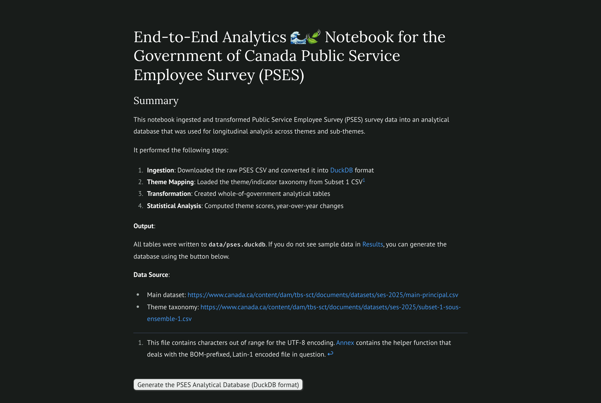

# PSES Analytics

This project was a proof-of-concept: build a standalone analytical pipeline for the Public Service Employee Survey (PSES) as a single marimo data-engineering notebook. It delivers that — ingestion, transformation, statistical analysis, and Survey Results visuals all run from one notebook backed by a DuckDB database.



## How to use

Prerequisites: Python 3.13+ and [uv](https://docs.astral.sh/uv/).

```bash
cd pses-analytics
uv sync
uv run marimo edit notebooks/pses_analytics.py
```

Run from the repository root so the notebook resolves `data/pses.duckdb`. The first build downloads the raw PSES CSV and constructs the database; once `data/pses.duckdb` exists, the Survey Results visuals auto-render with no button click required.

## Expected dependencies

DuckDB, Polars, Marimo, Plotly, SciPy (declared in `pyproject.toml`). SQL lives in `sql/` templates — exec and display cells share the same `.sql` files via `str.format()`, so the SQL shown in the notebook equals the SQL that executes.

## Project structure

```
pses-analytics/
├── notebooks/
│   └── pses_analytics.py          # pipeline + visuals
├── sql/                            # .sql templates shared by exec + display cells
│   ├── 01_raw_pses.sql … 10_chi_fetch.sql
│   └── sample_pses_wog.sql
└── data/                           # generated DuckDB database (gitignored)
    └── pses.duckdb
```
